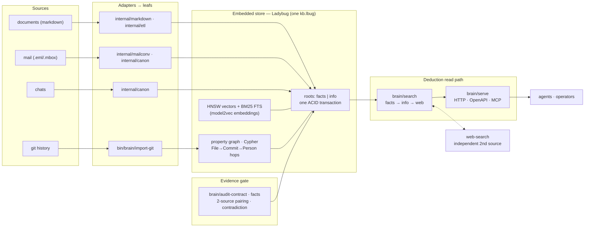

# 2dph — evidence-first brain

[](https://opensource.org/licenses/MIT)
[](https://go.dev)
[](https://github.com/eSlider/2dph/actions/workflows/ci.yml)

An evidence-first brain. **Facts need two independent sources, or they are
`(not confirmed)`.**
`2dph` is a single embedded knowledge graph (LadybugDB) with native **HNSW
vector** + **BM25 full-text** indexes. Search is *deduction*: confirmed facts
first, supporting info second, `web-search` as the independent second source
when the local graph cannot confirm.

## What's in 2dph

- **Single embedded store** — one file `kb.lbug` (LadybugDB).
- **Native property graph** + Cypher.
- **Native HNSW** (vectors, 256-dim model2vec) + **BM25 FTS**.
- **Hybrid search** — `facts → info → web`.
- **Graph-hop** (`--hop N`: File → Commit → Person).
- **ACID transactions** — facts + info in one transaction.
- **Incremental write** + bulk rebuild.
- **Evidence gate** — `internal/facts`: two-source pairing, contradiction
  adjudication, formal URL checks, confidence + staleness audit.
- **HTTP / MCP** — `bin/brain/serve.go` exposes `/health`, `/search`, `/get`,
  `/stats`, `/audit`, `/ingest`, `/openapi.json` and a MCP tool surface.

## Tool layout

Every command lives at `bin/{subject}/{method}.go` — one method per file, shared
logic in `internal/`. The filename *is* the invocation:

| Subject | Method | Does |
|---------|--------|------|
| `bin/brain` | `search.go` | deduction search (facts → info → web) |
| `bin/brain` | `index.go` / `add.go` | bulk rebuild / incremental write |
| `bin/brain` | `serve.go` | HTTP API + OpenAPI/MCP |
| `bin/brain` | `get.go` / `stats.go` | read a chunk by id / index health |
| `bin/brain` | `eval.go` / `bench.go` | recall@5 gate / search bench |
| `bin/brain` | `ann.go` | ANN (HNSW) inspection tool |
| `bin/brain` | `client.go` | read-contract client (SDK + CLI) |
| `bin/brain` | `audit-contract.go` | facts audit over the HTTP contract |
| `bin/brain` | `import-git.go` | commit history leafs (go-git, no git binary) |
| `bin/brain` | `model.go` | fetch the embedding model (pure Go) |
| `bin/brain` | `seed-ext.go` | pre-cache Ladybug extensions (FTS/VECTOR) |
| `bin/cgo` | `zig` / `zcc` / `zc++` | pinned Zig CGO toolchain (Ladybug + tokenizers) |

Go methods are executable (`go run` shebang); the read tools (`client`,
`read-contract`) and `model.go` are pure Go, the Ladybug write/read path is
Go + Zig CGO (`bin/cgo`).

**`bin/cgo`** is the CGO toolchain, **not** CI/CD: `zig` (the pinned Zig
compiler), `zcc` / `zc++` (wrappers). Ladybug and tokenizer C libraries are
compiled with `zig cc`, so brain binaries link CGO without a system gcc.

## Architecture



Reads are deduction: confirmed `facts` first, supporting `info` second,
`web-search` as the independent second source when the local graph cannot
confirm. Writes never bypass the store's single transaction.

## The method

Every assertion is `Who / What / How / Where / When + evidence + confidence`,
mirroring the detective method: **≥2 independent sources confirm a
fact; conflicting sources or a single source → `hypothesis` → `(not confirmed)`.**
The local graph is one source; `web-search` is the independent second one.

| root | meaning | used for answers |
|------|---------|------------------|
| `facts` | assertions backed by ≥2 sources (`confirmed`) | yes, with evidence links |
| `info` | descriptive/narrative leafs (how-tos, notes) | context only, marked `(not confirmed)` |

## Deduction search

```bash
bin/brain/search.go "LadybugDB vector index"         # facts → info → web
bin/brain/search.go "hybrid search" --root facts
bin/brain/search.go "upstream flag" --no-web         # local graph only
bin/brain/get.go <id> --body                         # full chunk on demand
bin/brain/stats.go                                   # index health
bin/brain/eval.go                                    # recall@5 gate
bin/brain/bench.go --inproc --json                   # search bench (recall gate)
```

`--hop N` walks File/Commit/Person from each hit (max 3).

Git history is read with [go-git](https://github.com/go-git/go-git) (no git
binary):

```bash
bin/brain/import-git.go --json --limit 100              # commit leafs for this repo
bin/brain/import-git.go --root "$PROJECTS_ROOT" --json  # one pass per .git under root
```

Web search (second independent source) goes through a SearXNG instance. Empty
results mean **throttled**, not "nothing exists". The HTTP client is the
supported way for agents/scripts to read facts, info and audit without touching
`kb.lbug` directly:

```bash
bin/brain/client.go search "LadybugDB vector index" --json
bin/brain/client.go search "hybrid search" --root facts --json
bin/brain/client.go get <id> --body
bin/brain/client.go stats
bin/brain/client.go audit
```

## Storage

- **LadybugDB** — single `kb.lbug`, Cypher + HNSW + BM25, embedded.
  Read tools (`get` / `stats` / `eval`) are Go + Zig CGO (`bin/cgo/zcc`).
  Incremental write is `bin/brain/add.go`; bulk rebuild is
  `bin/brain/index.go --rebuild`.
- **potion-multilingual-128M** — 256-dim embeddings (Go/Ladybug, CPU, no
  Ollama) — runtime dependency, downloaded by `bin/brain/model.go`.
- facts and info split by `root` but written in the same transaction.

## Development

```bash
go vet ./...            # default tags: everything except the Ladybug CGO core
go test ./...           # offline unit tests (fixtures, no network)
bin/cgo/zig go test -tags system_ladybug ./internal/brain/...   # CGO core tests
```

Docker (optional; builds the API image with Zig CGO):

```bash
docker build --target api -t 2dph:api .
docker run --rm -p 8630:8630 2dph:api        # serve (health on :8630/health)
```

## Related

- [go-second-brain](https://github.com/eSlider/go-second-brain) — the earlier
  Neo4j + Qdrant + Matrix RAG brain
- [agent-skills](https://github.com/eSlider/agent-skills) — upstream skills
  (`web-search`, `postgres`, …) that 2dph integrates
- detective method — the two-source method

Work board and the full decision log stay on the private instance; this public
repository is a clean product snapshot.
