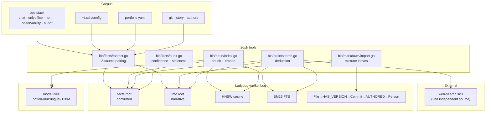

# 2dph — deductionphile

[](https://opensource.org/licenses/MIT)
[](https://python.org)
[](https://docs.astral.sh/uv)
[](https://github.com/eSlider/2dph/actions/workflows/ci.yml)
[](https://github.com/eSlider/2dph/releases)
[](https://github.com/eSlider/2dph/stargazers)

An evidence-first brain over the operational eSlider stack. **Facts need two
independent sources, or they are `(not confirmed)`.**

`2dph` is a single embedded knowledge graph (LadybugDB = Kuzu successor) with
native **HNSW vector** + **BM25 full-text** indexes, built from markdown,
compose files, ssh config, docker state, and git history. Search is
*deduction*: confirmed facts first, supporting info second, `web-search` as
the independent second source when the local graph cannot confirm.

## Architecture



## The method

Every assertion is `Who / What / How / Where / When + evidence + confidence`,
mirroring the detective detective skill: **≥2 independent sources confirm a
fact; conflicting sources or a single source → `hypothesis` → `(not confirmed)`.**

| root | meaning | used for answers |
|------|---------|------------------|
| `facts` | assertions backed by ≥2 sources (`confirmed`) | yes, with evidence links |
| `info` | descriptive/narrative leafs (how-tos, notes) | context only, marked `(not confirmed)` |

## Deduction search

```bash
bin/brain/search.go "Matrix federation over HTTPS"   # facts → info → web
bin/brain/search.go "onlyoffice postgres" --root facts
bin/brain/search.go "where is cs-lexicon" --json | yq '.'
bin/brain/search.go "upstream flag" --no-web         # local graph only
bin/brain/get.go <id> --body                         # full chunk on demand
bin/brain/stats.go                                   # index health
bin/brain/eval.go                                    # recall@5 gate
```

`--hop` is not implemented (needs File/FROM_FILE edges); the flag errors instead of walking. `bin/kb/search` is a deprecated wrapper around `bin/brain/search.go`.

Git history is read with [go-git](https://github.com/go-git/go-git) (no git binary):

```bash
bin/git/import.go --json --limit 100              # commit leafs for this repo
bin/git/import.go --root "$PROJECTS_ROOT" --json  # one pass per .git under root
```

Conversion only. Graph write (`File-[:HAS_VERSION]->Commit-[:AUTHORED]->Person`) stays with `bin/brain/index.go`.

Web search (second independent source) goes through SearXNG. Empty results mean **throttled**, not “nothing exists”:

```bash
bin/web/search.go "LadybugDB vector index" --json
# Optional local instance (skip if BRAIN_SEARCH_URL already points at one):
# SEARXNG_SECRET=$(openssl rand -hex 32) docker compose --profile searxng up -d
```

Mail is a first-class corpus (retrievable through the same search):

```bash
bin/mail/sync.go --source onlyoffice,gmail --workers 8 --out var/mail  # raw sync (Go)
bin/mail/import.go --from-raw var/mail                                  # JSON → markdown
bin/brain/index.go --rebuild                                            # rebuild brain (incl. mail)
bin/brain/search.go "invoice from last week"                            # same search over mail leafs
```

## Storage

- **LadybugDB** — single `var/kb.lbug`, Cypher property graph, HNSW + BM25
  in one engine, embedded (no server), ACID, read-only-safe for concurrent
  readers. Read tools (`get` / `stats` / `eval`) are Go + cgo; Python
  `bin/kb/{get,stats,eval}` is the CI fallback. **Never `DROP INDEX` FTS/VECTOR** on Ladybug 0.19: DROP leaves
  ghost catalog tables (`_0_Leaf_vec_UPPER`) so recreate fails while
  `SHOW_INDEXES` omits HNSW. Fresh indexes = delete `var/kb.lbug` +
  `bin/brain/index.go --rebuild`. Use `ensure_indexes()` after upserts.
- **model2vec** — `potion-multilingual-128M` static embeddings (256-dim),
  CPU-fast, deterministic, no Ollama runtime dependency.
- facts and info split semantically by `root` column but written inside the
  same transaction.

## Tooling conventions

`bin/{subject}/{method}.go` — self-describing: shebang on line 1, usage comment
from line 2. Shared code in `internal/`. YAML default output, `--json` for
machines. Tests gate every commit. HTTP: `bin/brain/serve.go` calls
`internal/brain` in-process (`/health` `/search` `/get` `/stats` `/audit` `/ingest` `/openapi.json` `/mcp`).

## Development

```bash
uv venv .venv                                  # Python 3.12, uv-managed
uv pip install -r requirements.lock.txt        # pinned toolchain
bin/facts/audit.go self                        # lexicon consistency gate
go test ./... && python -m unittest discover -s bin/tools -t .
```

Docker (optional, cached model + var volumes):

```bash
docker compose run --rm brain index            # (re)index corpus
docker compose run --rm brain search "query"   # one-shot query
docker compose run --rm brain serve            # bin/brain/serve.go
docker compose up brain-watch                  # auto re-index on change
```

## Related

- [go-second-brain](https://github.com/eSlider/go-second-brain) — the earlier
  Neo4j + Qdrant + Matrix RAG brain
- [agent-skills](https://github.com/eSlider/agent-skills) — upstream
  skills (`web-search`, `db-yaml`, …) that 2dph integrates
- detective method — the two-source method

Work board (issues): [git.produktor.io/eSlider/2dph/issues](https://git.produktor.io/eSlider/2dph/issues).
PRs and CI: GitHub [`eSlider/2dph`](https://github.com/eSlider/2dph).

See [PLAN.md](PLAN.md) for decisions, execution status, and v2 open questions.
