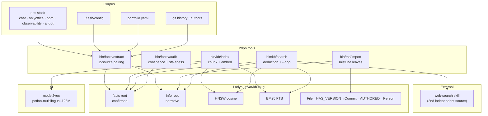

# 2dph — deductionphile

[](https://opensource.org/licenses/MIT)
[](https://python.org)
[](https://docs.astral.sh/uv)
[](https://github.com/eSlider/2dph/actions/workflows/ci.yml)
[](https://github.com/eSlider/2dph/releases)
[](https://github.com/eSlider/2dph/stargazers)

An evidence-first brain over the operational eSlider stack. **Facts need two
independent sources, or they are `(not confirmed)`.**

`2dph` is a single embedded knowledge graph (LadybugDB = Kuzu successor) with
native **HNSW vector** + **BM25 full-text** indexes, built from markdown,
compose files, ssh config, docker state, and git history. Search is
*deduction*: confirmed facts first, supporting info second, `web-search` as
the independent second source when the local graph cannot confirm.

## Architecture



## The method

Every assertion is `Who / What / How / Where / When + evidence + confidence`,
mirroring the CuraSoft detective skill: **≥2 independent sources confirm a
fact; conflicting sources or a single source → `hypothesis` → `(not confirmed)`.**

| root | meaning | used for answers |
|------|---------|------------------|
| `facts` | assertions backed by ≥2 sources (`confirmed`) | yes, with evidence links |
| `info` | descriptive/narrative leafs (how-tos, notes) | context only, marked `(not confirmed)` |

## Deduction search

```bash
bin/kb/search "Matrix federation over HTTPS"      # facts → info → web-search
bin/kb/search "what runs on arc-2" --hop 1        # walk graph edges
bin/kb/search "where is cs-lexicon" --json | yq '.'  # YAML by default
bin/kb/get <id> --body                            # full chunk on demand
bin/kb/stats                                      # index health
bin/kb/eval                                       # recall@5 gate
```

## Storage

- **LadybugDB** — single `var/kb.lbug`, Cypher property graph, HNSW + BM25
  in one engine, embedded (no server), ACID, read-only-safe for concurrent
  readers.
- **model2vec** — `potion-multilingual-128M` static embeddings (256-dim),
  CPU-fast, deterministic, no Ollama runtime dependency.
- facts and info split semantically by `root` column but written inside the
  same transaction.

## Tooling conventions

`bin/{subject}/{method}` — self-describing: shebang on line 1, usage comment
from line 2. bash + python primary; golang via the Go shebang when a compiled
helper is right. YAML default output, `--json` for machines. Everything that
touches network/db is read-only, throttled, cached. Tests gate every commit.

## Development

```bash
uv venv .venv                                  # Python 3.12, uv-managed
uv pip install -r requirements.lock.txt        # pinned toolchain
bin/facts/audit self                           # lexicon consistency gate
go test ./... && python -m unittest discover -s tools -t .
```

Docker (optional, cached model + var volumes):

```bash
docker compose run --rm brain index            # (re)index corpus
docker compose run --rm brain search "query"   # one-shot query
docker compose up brain-watch                  # auto re-index on change
```

## Related

- [go-second-brain](https://github.com/eSlider/go-second-brain) — the earlier
  Neo4j + Qdrant + Matrix RAG brain
- [agent-skills](https://git.produktor.io/edelweiss/agent-skills) — upstream
  skills (`web-search`, `db-yaml`, …) that 2dph integrates
- [curasoft-detective](https://github.com/curasoft) — the two-source method

See [PLAN.md](PLAN.md) for decisions, execution status, and v2 open questions.