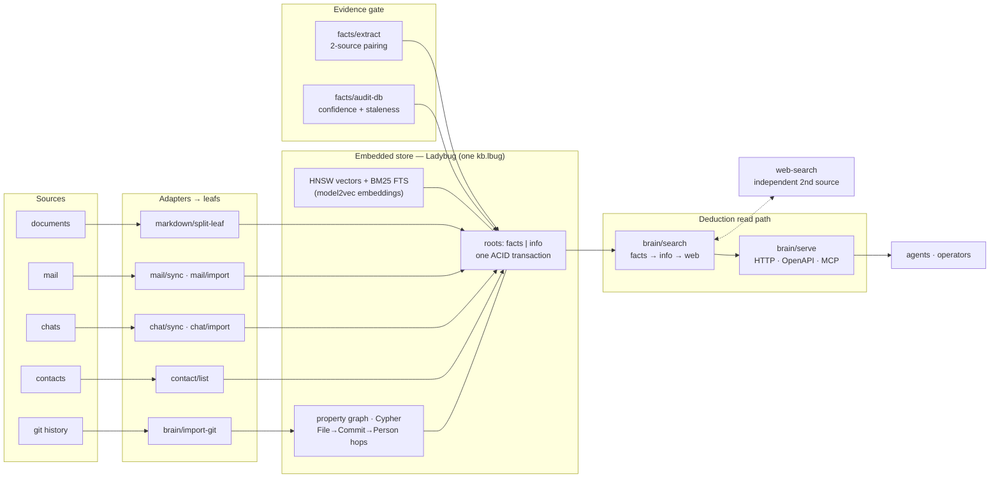

# 2dph — deductionphile

[](https://opensource.org/licenses/MIT)
[](https://go.dev)
[](https://github.com/eSlider/2dph/actions/workflows/ci.yml)
[](https://github.com/eSlider/2dph/releases)
[](https://github.com/eSlider/2dph/stargazers)

An evidence-first brain. **Facts need two independent sources, or they are
`(not confirmed)`.**

`2dph` is a single embedded knowledge graph (LadybugDB) with native **HNSW
vector** + **BM25 full-text** indexes. Search is *deduction*: confirmed facts
first, supporting info second, `web-search` as the independent second source
when the local graph cannot confirm.

## What's in 2dph today

- **Single embedded store** — one file `var/kb.lbug` (LadybugDB).
- **Native property graph** + Cypher.
- **Native HNSW** (vectors, 256-dim model2vec) + **BM25 FTS**.
- **Hybrid search** — `facts → info → web`.
- **Graph-hop** (`--hop N`: File → Commit → Person).
- **ACID transactions** — facts + info in one transaction.
- **Incremental write** + bulk rebuild.
- **DuckDB** as auxiliary (D22 / OQ3): quantiles, JSONL stats via duckdb-go
  in-process — a helper tool, **not** the primary store.

Run it: [docs/runbook.md](docs/runbook.md). Design: [docs/design.md](docs/design.md).
Docs index: [docs/README.md](docs/README.md).

## Tool layout (D14)

Every command lives at `bin/{subject}/{method}.go` — one method per file, shared
logic in `internal/`. The filename *is* the invocation, and the subject is the
domain area it acts on:

| Subject | Method | Does |
|---------|--------|------|
| `bin/brain` | `search.go` | deduction search (facts → info → web) |
| `bin/brain` | `index.go` / `add.go` | bulk rebuild / incremental write |
| `bin/brain` | `serve.go` | HTTP API + OpenAPI/MCP |
| `bin/facts` | `extract.go` / `audit.go` / `crm.go` | 2-source pairing, confidence, CRM proof |
| `bin/mail` | `sync.go` / `import.go` / `ocr.go` | mail ETL (Gmail/OO/M365) |
| `bin/web` | `search.go` | SearXNG second source |
| `bin/git` | `import.go` | commit history leafs |
| `bin/chat` | `sync.go` / `import.go` / `apply.go` | conversations |
| `scripts/stack` | `start` / `status` / `stop` | compose dispatcher |

Go methods are executable (`go run` shebang); a few are thin bash launchers
(`bin/chat`, `scripts/db/psql-yq`). Shell completions for all tools (D23) come from
`bin/shell/complete.go` — see the runbook. Keep it one-command-one-file so the
surface stays deductive: you read the path, you know the tool.

**`bin/cgo`** is the CGO toolchain, **not** CI/CD: `zig` (the pinned Zig
compiler), `zcc` / `zc++` (wrappers). Ladybug and tokenizer C libraries are
compiled with `zig cc` (D21), so brain read/write Go binaries link CGO without
a system gcc. CI/CD lives separately in `.github/workflows/ci.yml`.

## Architecture



Reads are deduction: confirmed `facts` first, supporting `info` second,
`web-search` as the independent second source when the local graph cannot
confirm. Writes never bypass the store's single transaction.

## The method

Every assertion is `Who / What / How / Where / When + evidence + confidence`,
mirroring the detective method: **≥2 independent sources confirm a
fact; conflicting sources or a single source → `hypothesis` → `(not confirmed)`.**

| root | meaning | used for answers |
|------|---------|------------------|
| `facts` | assertions backed by ≥2 sources (`confirmed`) | yes, with evidence links |
| `info` | descriptive/narrative leafs (how-tos, notes) | context only, marked `(not confirmed)` |

## Deduction search

```bash
bin/brain/search.go "Matrix federation over HTTPS"   # facts → info → web
bin/brain/search.go "onlyoffice postgres" --root facts
bin/brain/search.go "where is cs-lexicon" --json | yq '.'
bin/brain/search.go "upstream flag" --no-web         # local graph only
bin/brain/get.go <id> --body                         # full chunk on demand
bin/brain/stats.go                                   # index health
bin/brain/eval.go                                    # recall@5 gate
```

`--hop N` walks File/Commit/Person from each hit (max 3). Search is `bin/brain/search.go`.

Git history is read with [go-git](https://github.com/go-git/go-git) (no git binary):

```bash
bin/brain/import-git.go --json --limit 100              # commit leafs for this repo
bin/brain/import-git.go --root "$PROJECTS_ROOT" --json  # one pass per .git under root
```

Conversion only. Graph write (`File-[:HAS_VERSION]->Commit-[:AUTHORED]->Person`) stays with `bin/brain/index.go`.

Web search (second independent source) goes through SearXNG. Empty results mean **throttled**, not “nothing exists”:

```bash
bin/web/search.go "LadybugDB vector index" --json
# Optional local instance (skip if BRAIN_SEARCH_URL already points at one):
# SEARXNG_SECRET=$(openssl rand -hex 32) docker compose --profile searxng up -d
```

Mail is a first-class corpus (retrievable through the same search):

```bash
bin/mail/sync.go --source onlyoffice,gmail --workers 8 --out var/corpus/mail  # raw sync (Go)
bin/mail/sync.go --source m365 --env ~/.config/brain/mail.env          # Microsoft 365 Graph
scripts/stack/start-mail-sync                                              # compose ETL (300s; no auto-rebuild)
bin/mail/import.go --from-raw var/corpus/mail                                  # JSON → markdown
bin/brain/add.go --text T --root facts --source "a.md x b.md"
bin/brain/index.go --rebuild --with-facts --with-chats                  # facts extract + chats md
bin/brain/index.go --rebuild                                            # rebuild brain (incl. mail)
bin/brain/search.go "invoice from last week"                            # same search over mail leafs
```

## Storage

- **LadybugDB** — single `var/kb.lbug`, Cypher + HNSW + BM25, embedded.
  Read tools (`get` / `stats` / `eval`) are Go + Zig CGO (`bin/cgo/zcc`).
  Incremental write is `bin/brain/add.go`; bulk rebuild is
  Compose profile `index` (`bin/brain/index.go --rebuild`).
- **potion-multilingual-128M** — 256-dim embeddings (Go/Ladybug, CPU, no Ollama)
  runtime dependency.
- facts and info split by `root` but written in the same transaction.

Ladybug 0.19 DROP INDEX warning: [docs/runbook.md](docs/runbook.md).

## Tooling conventions

`bin/{subject}/{method}.go` — self-describing: shebang on line 1, usage comment
from line 2. Shared code in `internal/`. YAML default output, `--json` for
machines. Tests gate every commit. HTTP: `bin/brain/serve.go` calls
`internal/brain` in-process (`/health` `/search` `/get` `/stats` `/audit` `/ingest` `/openapi.json` `/mcp`).

## Development

See the portable runbook: [docs/runbook.md](docs/runbook.md).

```bash
bin/facts/audit.go self
go test ./...
```

Docker (optional, cached model + var volumes):

```bash
scripts/stack/start                                # brain HTTP/MCP :8630
scripts/stack/start-assistant                      # + qwen3.5:9b + PicoClaw agent
scripts/stack/status
scripts/stack/stop
docker compose up -d brain                     # API (Zig CGO serve :8630)
docker compose --profile index run --rm index  # Go Ladybug rebuild (zig cgo)
docker compose --profile picoclaw up brain-mcp # MCP on 127.0.0.1:8630
docker compose --profile reasoner up -d reasoner  # CPU Ollama 127.0.0.1:11435
docker compose up brain-watch                  # auto re-index on change
```

## Related

eSlider DevOps engineer practice: ops, OnlyOffice, and mail feed the facts
root through `bin/facts/extract` (two-source pairing).

- [go-second-brain](https://github.com/eSlider/go-second-brain) — the earlier
  Neo4j + Qdrant + Matrix RAG brain
- [agent-skills](https://github.com/eSlider/agent-skills) — upstream
  skills (`web-search`, `postgres`, …) that 2dph integrates
- detective method — the two-source method

Work board (issues): [epic #16](https://git.produktor.io/eSlider/2dph/issues/16)
on [git.produktor.io/eSlider/2dph/issues](https://git.produktor.io/eSlider/2dph/issues).
PRs and CI: GitHub [`eSlider/2dph`](https://github.com/eSlider/2dph).

See [PLAN.md](PLAN.md) for decisions, [docs/roadmap.md](docs/roadmap.md) for
the gap to v1, and v2 open questions.
