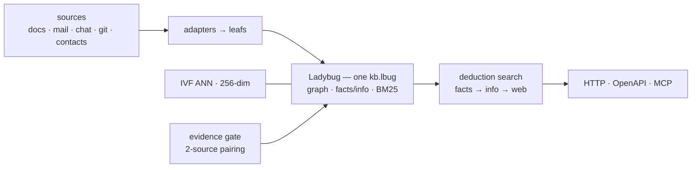

# 2dph — deductionphile

[](https://opensource.org/licenses/MIT)
[](https://go.dev)
[](https://github.com/eSlider/2dph/actions/workflows/ci.yml)
[](https://github.com/eSlider/2dph/releases)
[](https://github.com/eSlider/2dph/stargazers)

An evidence-first brain. **A fact needs two independent sources, or it is
`(not confirmed)`.**

2dph is a single embedded knowledge graph (LadybugDB) with BM25 full-text and
vector search. One query runs a deduction pass: confirmed facts first,
supporting notes second, web search as the independent second source when the
local graph cannot confirm.

## How it works

- **Two roots, one transaction** — `facts` (confirmed) and `info` (context)
  live in one ACID store, so the audit always sees a consistent snapshot.
- **Deduction read path** — `facts → info → web`; every hit carries evidence,
  confidence and freshness.
- **Evidence gate** — two-source pairing, contradiction and staleness checks.
- **Hybrid retrieval** — BM25 FTS + 256-dim model2vec embeddings, merged in
  the ranker.
- **Graph hops** — `--hop N` walks File → Commit → Person.

## Architecture


```mermaid
graph LR
    SRC["sources<br/>docs · mail · chat · git · contacts"]
      --> ADAPT["adapters → leafs"]
    ADAPT --> STORE["Ladybug — one kb.lbug<br/>graph · facts/info · BM25"]
    ANN["IVF ANN · 256-dim"] --- STORE
    STORE --> READ["deduction search<br/>facts → info → web"]
    READ --> API["HTTP · OpenAPI · MCP"]
    GATE["evidence gate<br/>2-source pairing"] --> STORE
```

## Why IVF, not HNSW

Ladybug's own HNSW index crashes once the graph grows (~1.3k nodes, #192), so
vector search lives **outside** liblbug. `coder/hnsw` was tried and rejected:
on 313k real embeddings only 34% of nodes stayed reachable and recall@5 fell
to 0.16.

The replacement is a small pure-Go **IVF** index (`internal/brain/ann`):
k-means cells plus exact cosine inside the probed cells, persisted as
`var/state/vector.ann` with an append-only WAL. It is updated incrementally,
rebuilt only when missing or more than 10% behind, and falls back to a linear
scan when absent or damaged — search never breaks.

Measured on 313,689 vectors: recall@5 vs exact scan = **1.0**, p50 ≈ **470 ms**
(#204/#206).

## Quick start

```bash
git clone https://github.com/eSlider/2dph && cd 2dph
bin/brain/index.go --rebuild                          # build the brain
bin/brain/search.go "Matrix federation over HTTPS"    # ask a question
bin/brain/serve.go                                    # HTTP + OpenAPI + MCP :8630
```

Incremental write is `bin/brain/add.go`; background indexing runs in the
compose `index-sync` cycle. Full setup: [docs/runbook.md](docs/runbook.md).

## What's inside

| Path | Role |
|------|------|
| `bin/brain` | search · index · serve |
| `bin/facts` | extract · audit — the evidence gate |
| `bin/mail`, `bin/chat`, `bin/git`, `bin/web` | corpus adapters |
| `internal/brain` | store, rank, ANN, FTS |
| `scripts/stack` | compose dispatcher |

## Docs

[runbook](docs/runbook.md) · [design](docs/design.md) ·
[docs index](docs/README.md) · [decisions](PLAN.md).

## Related

- [go-second-brain](https://github.com/eSlider/go-second-brain) — the earlier
  Neo4j + Qdrant + Matrix RAG brain
- [agent-skills](https://github.com/eSlider/agent-skills) — upstream skills
  (`web-search`, `postgres`, …) that 2dph integrates
