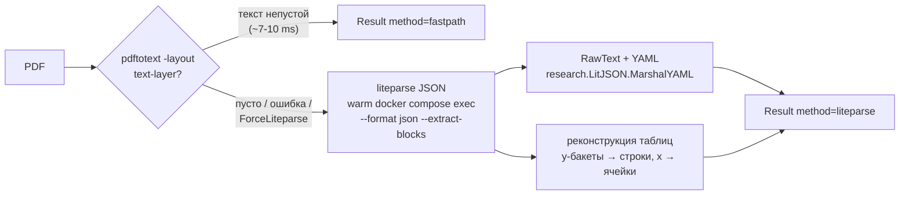

# PoC: гибридный docpipe handler — pdftotext + liteparse JSON + таблицы по геометрии (issue #223)

Подзадача эпика [#219](https://git.produktor.io/eSlider/2dph/issues/219)
(структурная экстракция документов). Развивает вывод A/B из
[docs/research-liteparse.md](docs/research-liteparse.md): **не замена, а
гибрид** — pdftotext fast path для text-layer, liteparse JSON для
сложных/сканов, реконструкция таблиц по `text_items` (геометрия), потому что
ни один из базовых путей таблицу как структуру не распознаёт.

Пакет: `internal/docpipe/` (рядом с `internal/ocr`, тот не тронут). Прод-корпус
`var/corpus` не затрагивался; всё — `var/research/` (gitignored) +
`internal/docpipe/` + этот отчёт.

## Как работает handler

API (`internal/docpipe`):

- `Handle(ctx, path, Opts) (*Result, error)` — гибридный прогон.
- `ReconstructTables(pages, URLBase) []Table` — реконструкция по геометрии
  (отдельно вызываемая, чистая функция).
- `Opts{ForceLiteparse, OCR, Base, LitParser, PDFToText}` — хуки для тестов и
  для принудительного структурного пути (сканы).
- `Result{Method, Text, JSON, YAML, Tables, FastPathMs, LiteparseMs}`.

Правила гибрида:

1. Сначала fast path (`pdftotext -layout`, как `internal/ocr.PDFFile`).
   Непустой текст → результат, `method=fastpath`.
2. Fast path пуст / ошибка / `ForceLiteparse` → вызов тёплого сервиса через
   `internal/research.Runner` (`docker compose exec -T liteparse lit parse
   /v/<rel>.pdf --format json --extract-blocks --no-ocr [-o OCR]`). `--no-ocr`
   по умолчанию; `Opts.OCR` включает tesseract (сканы).
3. JSON→YAML — `research.LitJSON.MarshalYAML` (single implementation, yaml.v3
   с явными тегами; локального конвертера нет).
4. Таблицы реконструируются только на liteparse-пути — у pdftotext нет
   геометрии.

Зависимость от docker изолирована: `LitParser` — интерфейс (его
удовлетворяет `*research.Runner`), `PDFToText` — функция. Офлайн-тесты
подменяют оба; live-прогон — под build tag `research_docpipe`.

## Реконструкция таблиц (алгоритм)

`text_items` — позиционированные фрагменты (bbox + шрифт). Таблица
восстанавливается по геометрии:

1. Порог y-бакета = **половина медианного font_size** страницы (floor 2pt).
2. Сортировка items по y (затем x, затем текст — детерминизм). Items, чьё y
   отличается от якоря бакета не больше порога, — одна визуальная строка.
3. Внутри строки ячейки сортируются по x (слева направо).
4. **Строка таблицы = ≥2 ячеек.** Таблица = максимальный подряд идущий run
   многоячеечных строк (не менее 2 строк). Одноклеточные строки (заголовок
   документа, примечание) в таблицу не попадают.
5. Каждый узел получает URL в духе #100:
   `docpipe://pdf/<sha256[:16]>/doc/page[0]/table[0]/tr[1]/td[2]` (построение —
   `internal/address.New`).

### Результат на invoice-text (синтетический счёт, фикстура #220)

`text_items` (14 шт) → 7 y-бакетов: `INVOICE-7C2F9E` · `Client: Acme GmbH` ·
`Item|Qty|Price` · `Widget A|2|10.00` · `Widget B|1|25.00` · `Total|45.00` ·
`Note: net 14 days.`. Таблица = run из 4 строк:

| tr | Ячейки |
|----|--------|
| 0 | Item · Qty · Price |
| 1 | Widget A · 2 · 10.00 |
| 2 | Widget B · 1 · 25.00 |
| 3 | Total · 45.00 |

Заголовок документа, строка клиента и примечание остались вне таблицы
(одноклеточные). Ограничение PoC: ячейка = один `text_item` (склейка
разорванных на несколько items ячеек — следующий шаг; в счётах это редкость).

## Тесты (TDD, офлайн)

`internal/docpipe/docpipe_test.go` — без сети/docker/модели; фикстура
text_items сгенерирована в тесте по значениям из
`var/struct-data/<sha256(invoice-text.pdf)>.yml`:

- таблица invoice-text распознаётся как структура (4 строки, точные ячейки,
  одноклеточные строки не протекают);
- URL-адресация: `page[0]/table[0]`, `tr[1]`, `tr[1]/td[2]`;
- y-бакеты: 7 строк, gap 20pt > порога 5.5 → разные бакеты;
- нет многоячеечных строк → нет таблиц;
- fast path: реальный text-layer PDF (генерируется в тесте, корректный xref)
  → `method=fastpath`, liteparse-хук не вызывается (skip, если pdftotext
  отсутствует на PATH);
- fallback: fast path пуст → liteparse-хук → таблицы + YAML;
- `ForceLiteparse` минует fast path; оба пути падают → ошибка с обоими
  причинами.

`internal/research` JSON→YAML-конвертер уже покрыт своими тестами — не
дублировали, handler только импортирует.

## Прогон на реальном сэмпле (тёплый сервис, 2026-08-30)

`go test -tags=research_docpipe -run TestLive -v ./internal/docpipe/ -count=5`
— invoice-text.pdf через оба пути (docker compose exec, сервис `liteparse`
healthy):

| Путь | ms (5 прогонов) | p50 | p95 | Результат |
|------|-----------------|-----|-----|-----------|
| fast path (pdftotext -layout) | 6.4 / 8.6 / 7.7 / 8.4 / 6.4 | 7.7 | 10.1 | текст, колонки сохранены |
| liteparse JSON (warm) + таблицы | 124.0 / 109.6 / 103.1 / 121.5 / 122.5 | 121.5 | 127.8 | 1 таблица, 4 строки, ячейки точные |

**Таблица распознана**: `Item|Qty|Price`, `Widget A|2|10.00`,
`Widget B|1|25.00`, `Total|45.00` — структура с URL-адресами, а не размазанный
текст. Сумма счёта извлекается программно (`table[0]/tr[3]/td[1]` = `45.00`).

Fast path на этом документе в ~15 раз быстрее liteparse; демон-паттерн
(#226) держит liteparse в ~110-130 ms против ~700 ms старого `docker run`.

## Порог выбора (fast path vs liteparse)

- **fast path выигрывает всегда, когда есть text-layer**: быстрее на порядок
  и сохраняет колонки в тексте. `pdftotext` упал/пуст → liteparse.
- **Liteparse нужен, когда нужна структура/геометрия** (таблицы, bbox,
  извлечение полей счёта) или документ — скан/сложный:
  - вердикт `lit is-complex` — с осторожностью: `sparse-text` на маленьком
    text-layer счёте — ложное срабатывание (#221), поэтому PoC по умолчанию
    не верит вердикту, а полагается на пустоту fast path;
  - `invoice-scan.pdf` — pdftotext возвращает непустой мусорный run
    (`SCAN-9F31A1`) → для сканов принудительно `ForceLiteparse + OCR`;
  - структурные запросы (таблицы/поля) — `ForceLiteparse` осознанно.

## Интеграция в mailconv/etl (#96/#98)

- `internal/mailconv/handlers.go` — `pdfHandler` сейчас = `ocr.PDFFile`.
  Гибрид встаёт рядом: `pdfHandler → docpipe.Handle` (fast path отдаёт тот же
  pdftotext-текст, что и сегодня), liteparse-ветка — только по требованию
  (скан/структура), чтобы не добавить 120 ms каждому PDF-вложению.
- `internal/etl` Registry (`#96`) — handler по MIME; docpipe — кандидат на
  обработчик `application/pdf`, где `Result` → typed `Meta` + `Text` +
  lazy-`Children`, а `Tables` — гранулярные Item-узлы (#100): каждая ячейка —
  узел с URL и `sha256` контента, ссылки между частями только по URL.
- Разделение ответственности: `internal/ocr` (tesseract/gs-нормализация)
  остаётся как fallback для экспорт-защищённых PDF; docpipe — структурный
  путь. Решение о замене `ocr.PDFFile` — позже, за рамками PoC (#223).

## Вывод

**Handler готов к интеграции** в mailconv/etl как опциональный структурный
путь: офлайн-тесты зелёные (`go test -race ./internal/docpipe/...`), live-прогон
распознаёт таблицу синтетического счёта через тёплый сервис, метрики в
ожидаемых рамках (#221: ~7-10 ms fast, ~110-130 ms warm liteparse). Ограничения
PoC: ячейка = один `text_item` (без склейки разорванных), порог — половина
медианного font_size (без адаптации к многошрифтовым страницам), выбор пути
не автоматизирован через вердикт (нужен аккуратный порог по #221-выводам).
Следующие шаги эпика #219: склейка разорванных items, прогон по реальному
корпусу, интеграция docpipe в etl registry.
